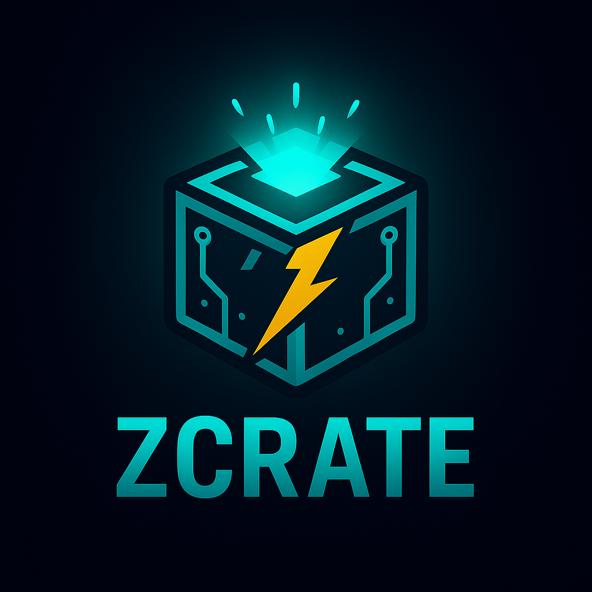

  

# zcrate

## Overview

**zcrate** is an efficient serialization and packaging library for Zig that serves as a modern alternative to Protocol Buffers, MessagePack, and Cap'n Proto. Built with performance and schema evolution in mind, zcrate provides powerful serialization capabilities with zero-copy deserialization.

## Features

- **Zero-copy deserialization** - Maximum performance with minimal memory overhead
- **Schema migration** - Seamless evolution of data structures over time
- **RPC integration** - Built-in support for remote procedure calls
- **Efficient serialization** - Optimized for both speed and size
- **Schema evolution** - Forward and backward compatibility support

## Scope

zcrate replaces traditional C libraries like Protocol Buffers, MessagePack, and Cap'n Proto, offering a pure Zig solution with superior performance characteristics and native integration with the Zig ecosystem.

## Getting Started

*Coming soon - this is a future project currently in planning phase*

## License

*To be determined*
